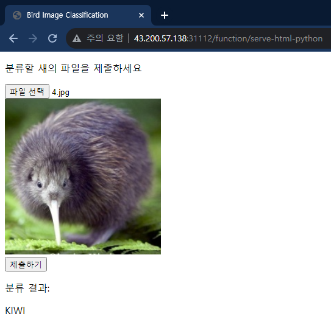

# Image Classification using OpenFaaS, PyTorch

## How to start

1. Set up Kubernetes and install [OpenFaaS](https://github.com/openfaas/faas) and [fass-netes](https://github.com/openfaas/faas-netes).
1. `git clone https://github.com/jinsub1999/FaaS-image-classification.git && cd Faas-image-classification`
1. `faas-cli up -f custom-faas.yml`
1. `faas-cli up -f serve-html-python.yml`

## How to inference your picture

By Using POST method in REST API, you can infer your `bird.jpg`

### CURL

`curl -XPOST -F "file=@./test-image/KIWI/1.jpg" <HOST IP>:31112/function/custom-faas`

### Get HTML and send file
First, Fix serve-html-python/html/index.html to your host IP.

`<HOST IP>:31112/function/serve-html-python`

